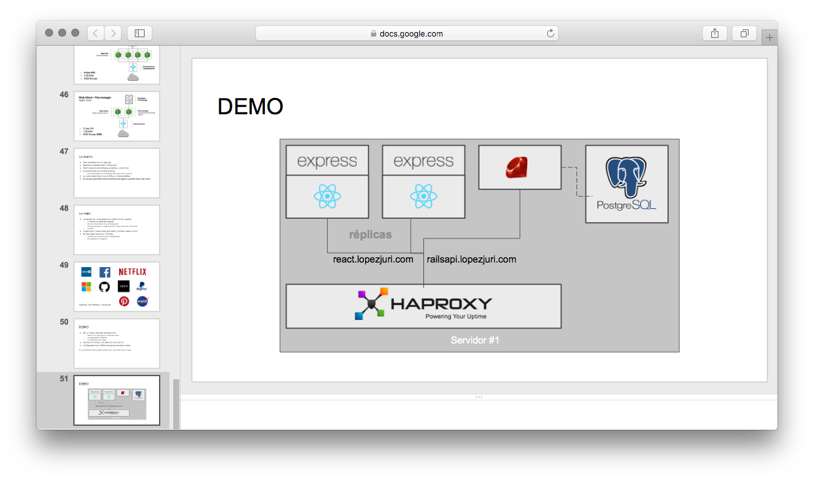

# Entorno React.js

> Check the [Google Slides here](https://docs.google.com/presentation/d/1CsmFxio9uZcKmU1hSlbJyvL3PeOMQM3EfzrErPlF8Pg/edit?usp=sharing)

[](https://docs.google.com/presentation/d/1CsmFxio9uZcKmU1hSlbJyvL3PeOMQM3EfzrErPlF8Pg/edit?usp=sharing)

## Project parts:

* Rails 5 API: https://github.com/mrpatiwi/entorno-react-api
* Express.js + React.js Frontend: https://github.com/mrpatiwi/entorno-react-web
* React-native Mobile app: https://github.com/mrpatiwi/EntornoReactMobile

## Setup for deployment

**Requisites: Docker and Docker-compose**

```sh
git clone https://github.com/mrpatiwi/entorno-react.git
cd entorno-react

git clone https://github.com/mrpatiwi/entorno-react-web.git
git clone https://github.com/mrpatiwi/entorno-react-api.git
```


Set:

```sh
# Set better strings on real environments
export POSTGRES_PASSWORD=PASSWORD
export SECRET_KEY_BASE=SECRET_KEY_BASE
```

Run services (see the [docker-compose.yml](./docker-compose.yml) v2 file):

```sh
docker-compose run -d
```

Remember to run the migrations with:

```sh
docker-compose run railsapi rails db:migrate
```

Scaling web client:

```sh
docker-compose scale webclient=2

# Check the logs
# The requests are balanced using round-robin
docker-compose logs --follow webclient
```
